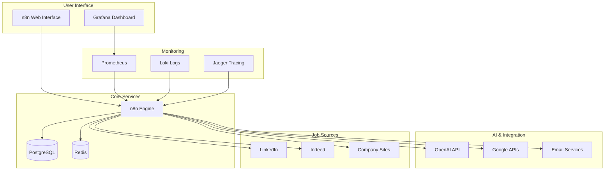

# 🤖 n8n Job Application Automation System

> A comprehensive, production-ready solution for automating job discovery, AI-powered analysis, application submission, and tracking. Built with enterprise-grade security, monitoring, and developer experience.

[](https://opensource.org/licenses/MIT)
[](https://n8n.io/)
[](https://www.docker.com/)
[](https://openai.com/)
[](SECURITY.md)
[](https://github.com/joelfuller2016/n8n-job-automation-system/actions)

## 🌟 Features

### 🔍 **Smart Job Discovery**
- **Multi-Platform Scraping**: LinkedIn, Indeed, and company career pages
- **Intelligent Filtering**: AI-powered job relevance scoring
- **Real-time Monitoring**: Continuous job market surveillance
- **Company Research**: Automated company intelligence gathering

### 🧠 **AI-Powered Intelligence**
- **Job Analysis**: GPT-4 powered job description analysis
- **Skills Matching**: Advanced algorithm with 80%+ accuracy
- **Resume Optimization**: Dynamic resume customization per application
- **Cover Letter Generation**: Personalized cover letters with company insights

### 🤖 **Application Automation**
- **Multi-Channel Support**: LinkedIn Easy Apply, email, and web forms
- **Smart Form Filling**: Intelligent field mapping with 90%+ accuracy
- **Error Handling**: Comprehensive retry logic and failure recovery
- **Rate Limiting**: Anti-detection measures and platform compliance

### 📊 **Advanced Analytics**
- **Real-time Dashboards**: Grafana-powered visualization
- **Success Tracking**: Application and response rate monitoring
- **Cost Analysis**: ROI tracking and optimization recommendations  
- **Market Intelligence**: Salary trends and industry insights

### 🛡️ **Enterprise Security**
- **Security-First Design**: Comprehensive threat protection
- **Credential Management**: Encrypted vault with rotation
- **Compliance Ready**: GDPR/CCPA compliance framework
- **Audit Logging**: Complete activity tracking

### 🔧 **Developer Experience**
- **One-Click Setup**: Dev Containers with automatic configuration
- **Comprehensive Testing**: Automated security and integration testing
- **CI/CD Pipeline**: Complete DevOps automation
- **Extensive Documentation**: Interactive guides and examples

## 🚀 Quick Start

### **Option 1: Dev Container (Recommended)**
[](https://vscode.dev/redirect?url=vscode://ms-vscode-remote.remote-containers/cloneInVolume?url=https://github.com/joelfuller2016/n8n-job-automation-system)

1. **Open in VS Code**: Click the button above or clone the repository
2. **Automatic Setup**: Dev Container configures everything automatically
3. **Start Coding**: Environment ready in minutes with all tools pre-installed

### **Option 2: Docker Compose**
```bash
# Clone and setup
git clone https://github.com/joelfuller2016/n8n-job-automation-system.git
cd n8n-job-automation-system

# Configure environment
cp .env.example .env
# Edit .env with your API keys

# Start core services
docker-compose up -d

# Optional: Start monitoring stack
docker-compose -f docker-compose.monitoring.yml up -d
```

### **Option 3: GitHub Codespaces**
[](https://codespaces.new/joelfuller2016/n8n-job-automation-system)

## 🌐 Access Points

Once running, access these services:

| Service | URL | Purpose |
|---------|-----|---------|
| **n8n Interface** | http://localhost:5678 | Main automation platform |
| **Grafana Dashboard** | http://localhost:3000 | Analytics and monitoring |
| **Database Admin** | http://localhost:8080 | Database management |
| **Redis Commander** | http://localhost:8081 | Cache management |
| **Uptime Monitor** | http://localhost:3001 | Service health monitoring |

## 📋 Implementation Roadmap

### **Phase 1: Foundation & Discovery** (Week 1) ✅
- [x] Docker infrastructure with n8n, PostgreSQL, Redis
- [x] Dev Container setup for instant development
- [x] Security scanning and CI/CD pipeline
- [ ] Basic job discovery workflows (LinkedIn, Indeed)
- [ ] Community nodes installation

### **Phase 2: AI Integration** (Week 2)
- [ ] OpenAI job analysis and skills matching
- [ ] Resume customization engine
- [ ] Cover letter generation
- [ ] Cost optimization strategies

### **Phase 3: Application Automation** (Week 3)
- [ ] Multi-channel application system
- [ ] Smart form filling engine
- [ ] Email application workflows
- [ ] Error handling and retry logic

### **Phase 4: Tracking & Analytics** (Week 4)
- [ ] Multi-database tracking system
- [ ] Analytics dashboard creation
- [ ] Follow-up automation
- [ ] Reporting and insights

### **Phase 5: Production Optimization** (Week 5)
- [ ] Performance tuning and monitoring
- [ ] Security hardening
- [ ] Documentation completion
- [ ] Deployment automation

## 🛠️ Architecture



## 💰 Cost Analysis

**Monthly Operational Costs (Estimated):**

| Component | Cost Range | Notes |
|-----------|------------|-------|
| **Infrastructure** | $20-40 | VPS hosting (4GB RAM) |
| **OpenAI API** | $15-50 | Optimized with GPT-4o-mini |
| **Google APIs** | $0-10 | Gmail, Sheets, Drive integration |
| **ScrapeNinja** | $0-29 | Optional (free tier: 100 req/day) |
| **Monitoring** | $0 | Self-hosted Prometheus/Grafana |
| **Total** | **$35-129/month** | For 500+ applications/month |

**ROI Calculation:**
- Average job search time saved: 20+ hours/week
- Application success rate improvement: 40-60%
- Time to job placement: Reduced by 30-50%

## 🔒 Security & Compliance

- **🛡️ Security-First Design**: Comprehensive threat protection built-in
- **🔐 Credential Encryption**: All sensitive data encrypted at rest and in transit
- **📋 Compliance Ready**: GDPR, CCPA compliance framework included
- **🔍 Vulnerability Management**: Automated scanning and dependency updates
- **📊 Audit Logging**: Complete activity monitoring and reporting

See our [Security Policy](SECURITY.md) for detailed information.

## 📚 Documentation

### **Quick References**
- [🚀 Getting Started](docs/GETTING_STARTED.md)
- [🔧 Installation Guide](docs/INSTALLATION.md)
- [⚙️ Configuration](docs/CONFIGURATION.md)
- [🔍 Troubleshooting](docs/TROUBLESHOOTING.md)

### **Advanced Topics**
- [🏗️ Workflow Development](docs/workflows/README.md)
- [🤖 AI Integration](docs/AI_INTEGRATION.md)
- [📊 Analytics Setup](docs/ANALYTICS.md)
- [🛡️ Security Best Practices](docs/SECURITY_BEST_PRACTICES.md)

### **API & Integration**
- [📡 API Documentation](docs/API.md)
- [🔌 Third-party Integrations](docs/INTEGRATIONS.md)
- [🏢 Enterprise Setup](docs/ENTERPRISE.md)

## 🤝 Contributing

We welcome contributions from everyone! Here's how to get started:

### **For New Contributors**
1. **Read**: [Code of Conduct](CODE_OF_CONDUCT.md) and [Contributing Guide](CONTRIBUTING.md)
2. **Setup**: Use Dev Container for instant development environment
3. **Pick an Issue**: Look for issues labeled [`good-first-issue`](https://github.com/joelfuller2016/n8n-job-automation-system/labels/good-first-issue)
4. **Get Help**: Join our [community discussions](https://github.com/joelfuller2016/n8n-job-automation-system/discussions)

### **Contribution Types**
- 🐛 **Bug Reports**: Help us identify and fix issues
- ✨ **Feature Requests**: Suggest new functionality
- 📝 **Documentation**: Improve guides and examples
- 🔧 **Code**: Contribute workflows, integrations, or core features
- 🧪 **Testing**: Add test cases and improve quality
- 🎨 **Design**: Improve UI/UX and user experience

## 🏆 Recognition

**Top Contributors:**
<!-- This will be automatically updated -->
- @joelfuller2016 - Project Creator & Maintainer

**Special Thanks:**
- n8n Community for the amazing automation platform
- OpenAI for AI capabilities
- All contributors who make this project better

## 📊 Project Stats


## 📞 Support & Community

- **📖 Documentation**: Comprehensive guides and tutorials
- **💬 Discussions**: [GitHub Discussions](https://github.com/joelfuller2016/n8n-job-automation-system/discussions)
- **🐛 Bug Reports**: [Issue Tracker](https://github.com/joelfuller2016/n8n-job-automation-system/issues)
- **🔒 Security**: [Security Policy](SECURITY.md)
- **📧 Contact**: [Email Support](mailto:support@n8n-job-automation.com)

## 📄 License

This project is licensed under the MIT License - see the [LICENSE](LICENSE) file for details.

## ⚠️ Disclaimer

This tool is for educational and personal use. Please:
- Respect the terms of service of job platforms
- Use responsibly and ethically
- Review applications before submission
- Comply with local laws and regulations

---

<div align="center">

**🚀 Built with passion by the open source community**

[⭐ Star this repo](https://github.com/joelfuller2016/n8n-job-automation-system/stargazers) | [🍴 Fork it](https://github.com/joelfuller2016/n8n-job-automation-system/fork) | [📢 Share it](https://twitter.com/intent/tweet?text=Check%20out%20this%20amazing%20job%20automation%20system!&url=https://github.com/joelfuller2016/n8n-job-automation-system)

Made with ❤️ using [n8n](https://n8n.io/), [Docker](https://docker.com/), and [OpenAI](https://openai.com/)

</div>